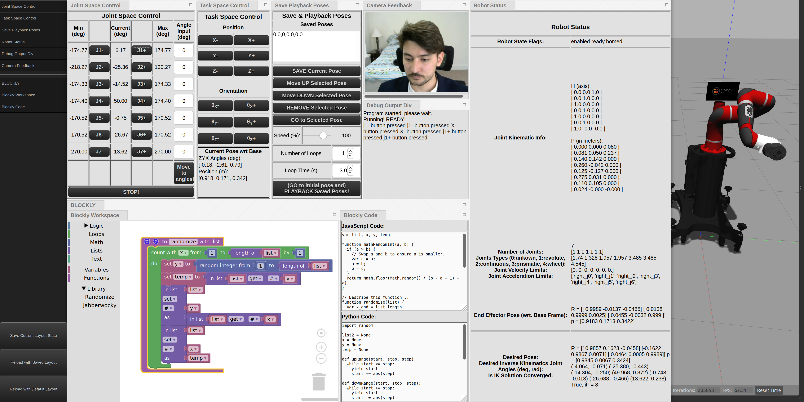

# TEACH PENDANT AND SAWYER SIMULATOR OVERVIEW #


**Video:** [Remote Control Sawyer Sim from a Windows Client Tablet](https://drive.google.com/file/d/1KFKODHFAj3hlqJ-viZdkoh6zxaIW1SyD/view?usp=sharing)

# SAWYER SIMULATOR SETUP STEPS TO TEST #

#### Latest Update: Sun 14 June 2020 ####
##### Author: Burak Aksoy #####

## STEPS FOR A FRESHLY INSTALLED UBUNTU 18.04 or UBUNTU 20.04 ##

**NOTE:** 

*A question: Can I use Ubuntu Xenial(16.04) and ROS kinetic, (or previous Ubuntu and ROS versions)?* 

*Answer: The teach pendant will be targeting a minimum Python version of 3.6. Version 3.6 added some important features like type hints. Unfortunately Ubuntu Xenial uses Python 3.5, so we will need to use a minimum of Ubuntu Bionic.* 

### A. INSTALL ROBOT RACONTEUR (RR) ###

1. Follow steps under title Ubuntu Xenial and Bionic at the GitHub page of RR:
https://github.com/robotraconteur/robotraconteur/wiki/Download
In summary of installation of RR for C++ and Python:

```
sudo add-apt-repository ppa:robotraconteur/ppa
sudo apt-get update
sudo apt-get install robotraconteur-dev
sudo apt-get install python-robotraconteur
sudo apt-get install python3-robotraconteur
```

### B. INSTALL ROS MELODIC (or Neotic for Ubuntu 20.04) ###

1. Follow the steps at ROS web page:
http://wiki.ros.org/melodic/Installation/Ubuntu

2. Additionally install effort controllers with command:
```
sudo apt-get install ros-melodic-effort-controllers
```

### C. INSTALL .NET Core 3.1  ###

1. Follow the steps at:
https://docs.microsoft.com/en-us/dotnet/core/install/linux-package-manager-ubuntu-1804

***Note:*** 
*Or you can use the tar method: 
https://dotnet.microsoft.com/download/dotnet-core/thank-you/sdk-3.1.404-linux-x64-binaries*


### D. INSTALL AND START THE SAWYER SIMULATOR ###

1. The summary of the commands are below:
```
mkdir -p ~/ros_ws/src
cd ~/ros_ws/src
git clone https://github.com/RethinkRobotics-opensource/sns_ik.git
git clone https://github.com/RethinkRobotics/sawyer_simulator.git
cd ~/ros_ws/src
wstool init .
wstool merge sawyer_simulator/sawyer_simulator.rosinstall
wstool update

source /opt/ros/melodic/setup.bash
cd ~/ros_ws
catkin_make
```

***Trouble shooting*** 
*If you see and error like*
```
/home/burak/ros_ws/src/sawyer_simulator/sawyer_gazebo/src/head_interface.cpp:71:44: error: ‘CV_LOAD_IMAGE_UNCHANGED’ was not declared in this scope
   71 |       cv_ptr->image = cv::imread(img_path, CV_LOAD_IMAGE_UNCHANGED); 
```
*Change that line to:*
```
cv_ptr->image = cv::imread(img_path, cv::IMREAD_UNCHANGED);
```
*For reference: https://stackoverflow.com/questions/28534070/cv-load-image-unchanged-undeclared-identifier* 


***Note:*** 
*Source for the commands above can be found under title Sawyer Simulator Installation at: 
https://sdk.rethinkrobotics.com/intera/Gazebo_Tutorial 
It says it is for Kinetic, but it has worked fine on Melodic
Also, the Github page: 
https://github.com/RethinkRobotics/sawyer_simulator*

2. Run the gazebo simulation:
```
source ~/ros_ws/devel/setup.bash
roslaunch sawyer_gazebo sawyer_world.launch 
```

***Note:***
*No need to execute $./intera.sh sim before this command as suggested in the website above since everything is in localhost.*

***Note:***
*If you see a REST error at roslaunch (source: https://www.youtube.com/watch?v=ftDz_EVoatw)*
```
cd ~/.ignition/fuel
gedit config.yaml
```
*Edit lines:*
```
    # url: https://api.ignitionfuel.org
    url: https://api.ignitionrobotics.org 
```
*and save.*

***Note:***
*You can check the status of the robot in Gazebo simulation with ROS command $ rostopic echo /robot/state.*

***Note:***
*To remove the effects of gravity, you can edit the gravity to 0.0 in line 17 of 
~/ros_ws/src/sawyer_simulator/sawyer_gazebo/worlds/sawyer.world*

***Note:***
*One of the links are invisible in the simulation. To solve,*
```
cd ~/ros_ws/src/sawyer_robot/sawyer_description/meshes
```
*Replace l5.dae file in sawyer_pv with the one from sawyer_ft*

### E. SET UP AND RUN SAWYER SIMULATION WITH RR DRIVER ###

***Note:*** 
*Before applying steps below, it is suggested to run the gazebo simulation first.*

1. Dowload Sawyer_bin_local and ros_csharp_interop folders into your eg. ~/Desktop.
(ASK* Are these explanations below correct?)
- Sawyer_bin_local folder is just for RR drivers implemented in C#. 
(Honglu shared the compiled version with some example python clients at: https://drive.google.com/open?id=199ZZrz64U1TeDs6prCTF4t8-HZsIKMez) 
(ASK* Honglu Says this is just a compiled version of https://github.com/johnwason/SawyerRobotRaconteurDriver)
- Ros_csharp_interop-master allows to read std ROS msgs using RR. (https://github.com/johnwason/ros_csharp_interop)

2. Make ros_csharp_ws directory at your home folder:
```
mkdir ros_csharp_ws
cd ros_csharp_ws/
mkdir src
```
3. Copy ros_csharp_interop folder into src:
```
cp -r ~/Desktop/ros_csharp_interop ./src/
```
4. Built the packages: 
```
cd ros_csharp_ws/
catkin_make_isolated
```

***Note:*** 
*If you see a SWIG error while catkin_make (go to: http://swig.org/svn.html or https://github.com/swig/swig):
go to home directory*
```
cd ~/
git clone https://github.com/swig/swig.git
cd ./swig
./autogen.sh
./configure
make
```

*If another error happens saying yacc: command not found:*
```
sudo apt-get install byacc -y
make
sudo make install
```
*Check the installation of SWIG:* 
```
swig -version
```
*OUTPUT should be smth like:*
```
"SWIG Version 4.0.2

Compiled with g++ [x86_64-pc-linux-gnu]

Configured options: +pcre

Please see http://www.swig.org for reporting bugs and further information"
```
*Again:*
```
cd ~/ros_csharp_ws/
catkin_make_isolated
```

5. Dont forget to source:
```
source ~/ros_csharp_ws/devel_isolated/setup.bash
```

6. Change your directory to Sawyer_bin_local that you downloaded
```
cd ~/Desktop/Sawyer_bin_local/
```
7. Initialize the Sawyer service (The service definition can be checked from: https://github.com/johnwason/robotraconteur_standard_robdef/blob/master/group1/com.robotraconteur.robotics.robot.robdef )
```
dotnet SawyerRobotRaconteurDriver.dll --robot-info-file=sawyer_robot_default_config.yml
```

***Note:***
*If you see an error as follows*
```
Unhandled exception. System.IO.IOException: Error in identifier settings file
  at RobotRaconteur.Companion.InfoParser.LocalIdentifiersManager.GetIdentifierForNameAndLock(String category, String name) in C:\Users\wasonj\Documents\RobotRaconteur2\RobotRaconteurNET.Companion\InfoParser\LocalIdentifierManager.cs:line 244
  at RobotRaconteur.Companion.InfoParser.RobotInfoParser.LoadRobotInfoYamlWithIdentifierLocks(YamlRobotInfo yaml_robot_info) in C:\Users\wasonj\Documents\RobotRaconteur2\RobotRaconteurNET.Companion\InfoParser\RobotInfoParser.cs:line 298
  at RobotRaconteur.Companion.InfoParser.RobotInfoParser.LoadRobotInfoYamlWithIdentifierLocks(String filename) in C:\Users\wasonj\Documents\RobotRaconteur2\RobotRaconteurNET.Companion\InfoParser\RobotInfoParser.cs:line 275
  at SawyerRobotRaconteurDriver.Program.Main(String[] args) in C:\Users\wasonj\Documents\RobotRaconteur2\drivers\SawyerRobotRaconteurDriver\Program.cs:line 73
Aborted (core dumped)
```
*It is about RR is not able to load the native dll. For solution run the following command:*
```
sudo apt install librobotraconteur-net-native
```


***Note:***
*STEPS 5-7 can be combined in a file eg. "commands" and can be executed with*
```
./commands
```
*for time saving because each time we need to use Sawyer RR service we need to execute these commands.*

*For eg. I have a bash script file like this:*
```
source ~/ros_csharp_ws/devel_isolated/setup.bash
cd ~/Sawyer_bin_local/
dotnet SawyerRobotRaconteurDriver.dll --robot-info-file=sawyer_robot_default_config.yml
```

*or create a file with the following lines:* 
```
sleep 1s; 
gnome-terminal --tab --title="Gazebo Sawyer Sim" --command "bash -c \"roslaunch sawyer_gazebo sawyer_world.launch;exec bash\""; 
gnome-terminal --tab --title="RR Sawyer service" --command "bash -c \"source ~/ros_csharp_ws/devel_isolated/setup.bash; cd ~/Sawyer_bin_local/; dotnet SawyerRobotRaconteurDriver.dll --robot-info-file=sawyer_robot_default_config.yml; exec bash\" ";
```

*Furhter possible ways can be seen: https://www.tothenew.com/blog/bash-script-to-open-a-terminal-with-multiple-tabs-on-linux-start-up/*

8. Test the simulation and run test clients and see the effects on Gazebo::
```
cd ~/Desktop/Sawyer_bin_local/

python test_sawyer_driver.py
python3 test_sawyer_driver2.py
python3 test_sawyer_driver3.py
```

***Note:***
*(ASK* is this correct?) Note: When you test you see some numbers. Those numbers are the summation of the RobotStateFlags defined in https://github.com/johnwason/robotraconteur_standard_robdef/blob/master/group1/com.robotraconteur.robotics.robot.robdef*

***Note:***
*There is also a way to install the Sawyer simulator on Windows. It somewhat works, but isn't all that reliable.*

*http://wiki.ros.org/Installation/Windows as stated by John Wason.*

***Note:***
*If you have an external python package like "general_robotics_toolbox", add it to my_source.zip*

### F. CONTROL SAWYER SIMULATION WITH TEACH PENDANT BROWSER INTERFACE ### 
*Now, the simulation is running, the RR service to control the robot is runnnig, let's control the robot from the Web Browser UI.*
*Use Mozilla Firefox Web Browser*
1. Setup Mozilla Firefox:
- Inside Firefox, type in `about:config` to the adress bar
- Modify `network.websocket.allowInsecureFromHTTPS` to be `true`,
- and `privacy.file_unique_origin` to be `false`.

***Note:***
*There's memory leak, after a while (e.g. many refreshes on the page) Firefox will be out of memory.*

2. Now run `RR-Client-WebBrowser.html` with Firefox.
- That's it!
- You can check the console details using (Ctrl + Shift + K) combination keyboard shortcut.